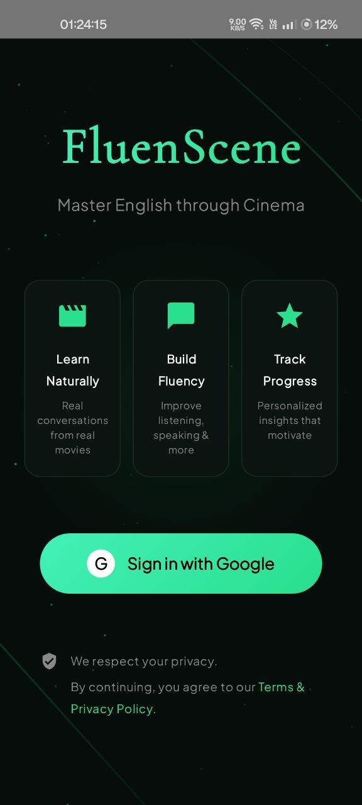
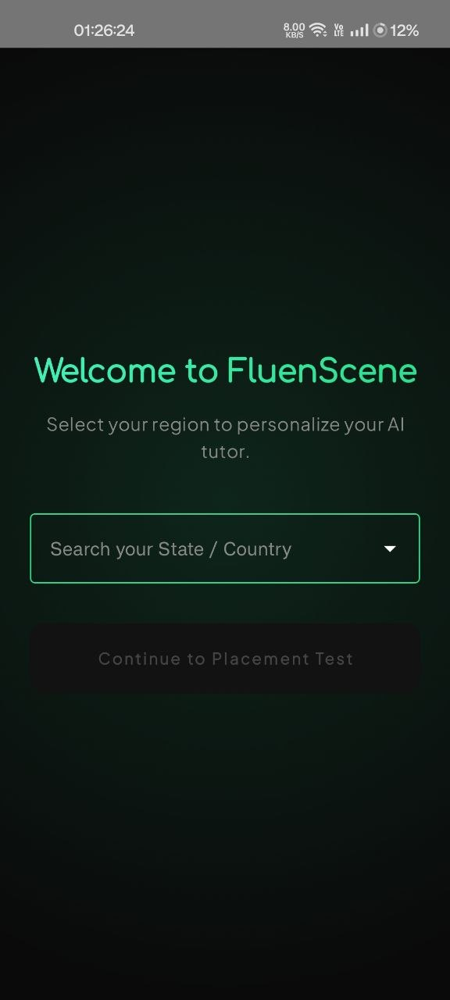
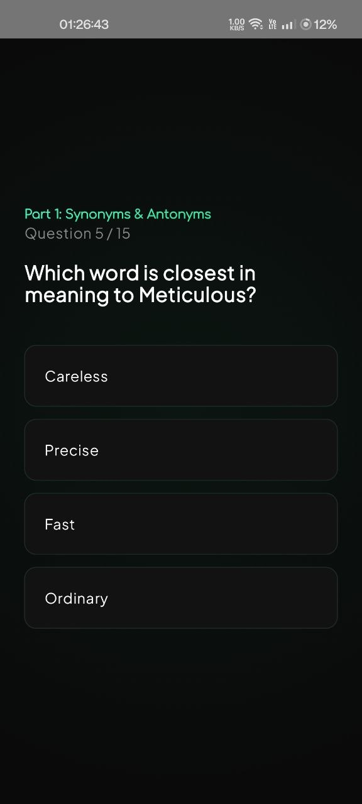
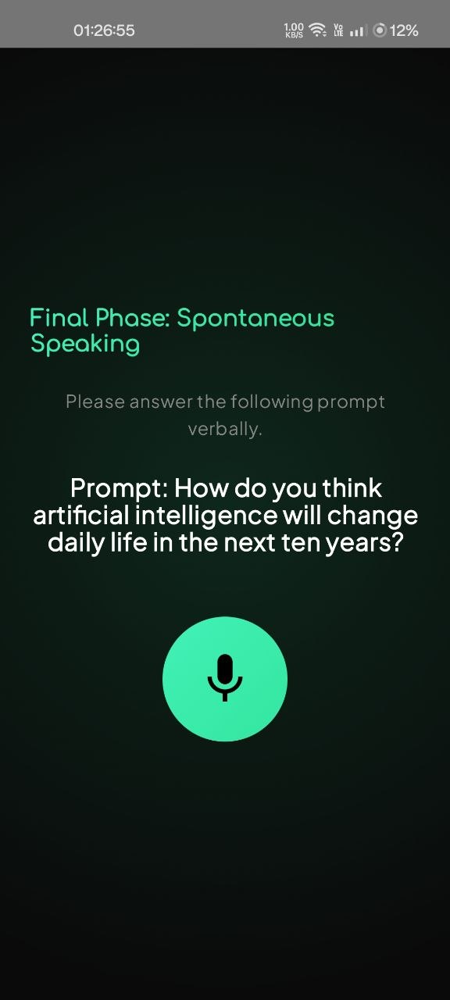
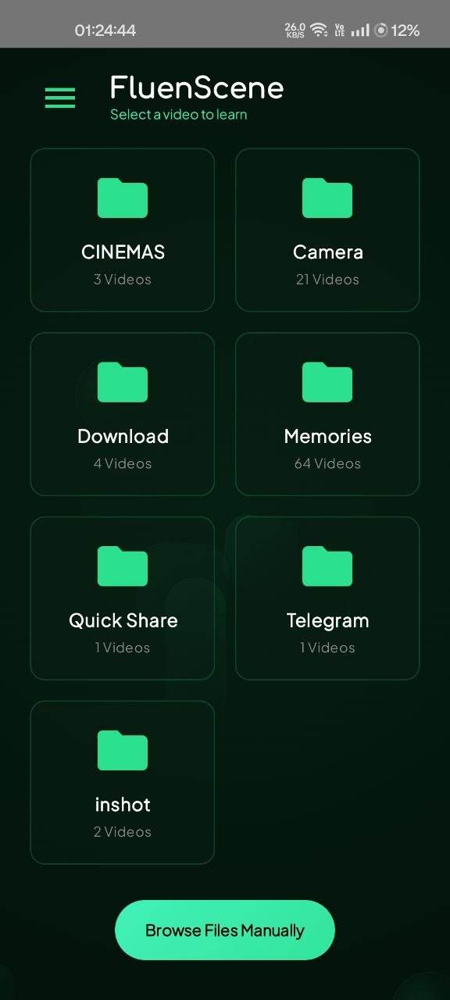
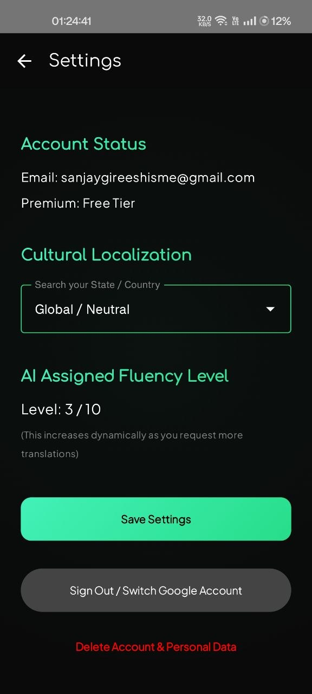
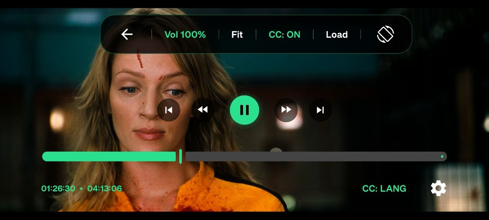
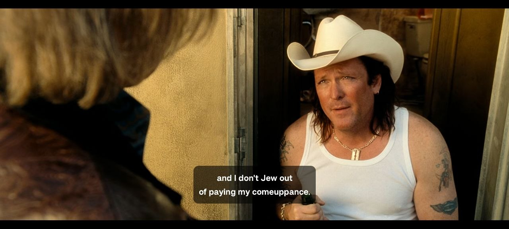
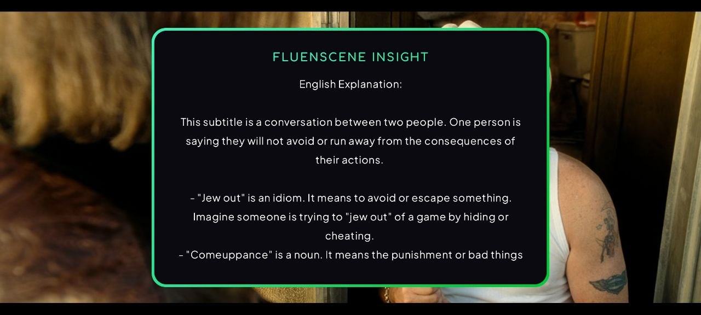

## 📸 Screenshots

### 1. Onboarding & AI Placement Test

  
  &nbsp;&nbsp;
  
  &nbsp;&nbsp;
  
  &nbsp;&nbsp;
  

### 2. Dashboard & Settings

  
  &nbsp;&nbsp;
  

### 3. Immersive Player & Contextual AI Insights

  
  &nbsp;&nbsp;
  
    
  

# FluenScene 
*Master English through Cinema!*

FluenScene is an AI-powered Android media player that helps users build conversational English fluency by contextually analyzing local video subtitles in real-time.

## Contributors
* **Sanjay Gireesh** (Project Lead, Android Architecture, Backend, AI Integration)
* **Prajin Sankar A U** (UI/UX Design, Logo Design)